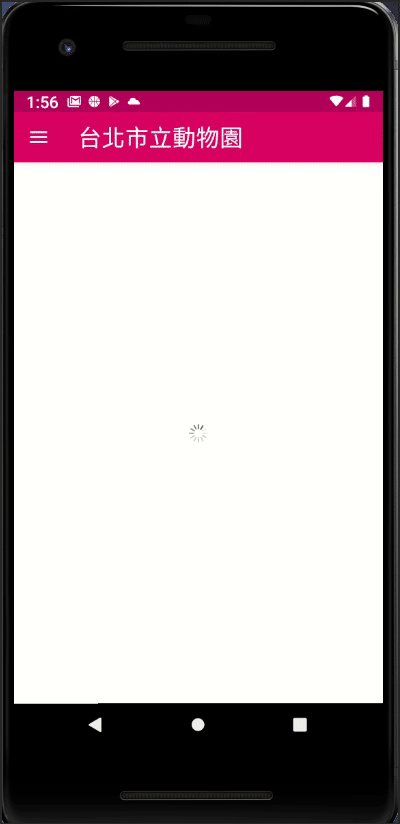

# taipei-zoo

此app共區分成3個頁面  
+ 首頁home
+ 園區詳細頁areaDetail
+ 植物詳細頁plantDetail  

個別使用ViewModel來保存狀態跟處理邏輯, 使用databinding來更新並顯示UI  
使用navigation來控制fragment之間的切換
共呼叫2個API
+ Get 動物園園區資料
+ Get 位於指定園區的植物資料

#### 第三方套件:

+ retrofit moshi okhttp 來處理網路功能
+ glide 處理圖片
+ broccoli 處理載入動畫

#### 示意圖:

